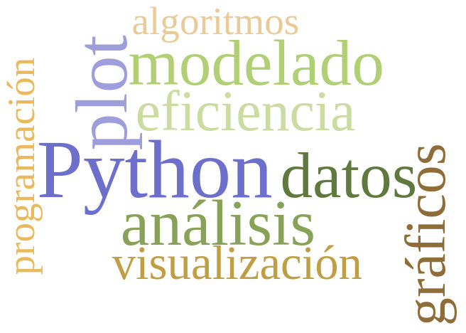

# Programacion en python (Programming in Python 3)

Here I provide all the material from the Python3 programming course used during the course dictated as part of the [Degree in Data-Science](https://www.unsam.edu.ar/escuelas/ciencia/661/ciencia/ciencia-de-datos) by the ["Escuela de Ciencia y Tecnología"](http://www.unsam.edu.ar/escuelas/ciencia/) from the "National University of San Martín" [(UNSAM)](https://www.unsam.edu.ar/) during the second semester of 2021.

Links to the github repository: https://github.com/python-unsam/programacion1
Links to the contents of the whole course: https://github.com/python-unsam/Programacion_en_Python_UNSAM/blob/master/Notas/Contenidos.md

All the code in here is original and has been coded by me.

